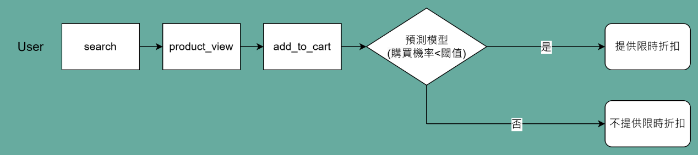

# Data Projects by Thomas Tsao

## 電商客戶行為分析與折扣優化（Python）

### 專案概述
* **背景源於一家販售各種產品（如家電，3C，食物和飲料，門鎖，嬰兒用品等）的早期電商公司，希望提升其產品銷售轉化率。為了增加客戶購買意願，該公司打算提供折價券以刺激消費，但由於「折扣活動的預算有限」，因此希望透過分析用戶行為，以決定提供折價券的有利時機，從而優化業務流程。為此，我們分別從「用戶角度」及「產品角度」進行分析，並使用實務上常見的顧客價值分析方法 - 「RFM 模型」，用於客戶分群，以了解不同客戶群體的消費行為，進而提供針對性的營銷策略。此外，我們從用戶消費流程中找出了適合提供折價券的情境，並建立「預測模型」，該模型用以預測符合上述情境的使用者購買產品的機率，透過該模型，我們能找出潛在放棄消費的用戶，並提供折價券以鼓勵購買，而不是將折價券提供給非常有可能會購買的用戶。最終，我們在不同層面提供了相應的決策建議，並期望透過預測模型提升產品銷售轉化率，以有效利用折扣預算。**
* **資料筆數：2,090筆**
* **使用工具：**
  * **程式語言：Python 3.10.12（pandas、numpy、matplotlib、seaborn、sklearn、 spacy、datetime）**
  * **AI工具：[ChatGPT-4o](https://openai.com/index/hello-gpt-4o/)（提供分析框架靈感及數據洞察，代碼優化），[Claude 3.5](https://www.anthropic.com/news/claude-3-5-sonnet)（提供用戶行為路徑流程圖設計靈感）**
  * **繪圖軟體：[draw.io](https://app.diagrams.net/)（製作預測模型情境圖）**

**[請點擊此處觀看](https://thomastsao47.github.io/Ecommerce_Project/)  **
 

## 客戶服務分析與優化（Excel）

### 專案概述
* **為了解企業客服中心（Call Center）提供客戶詢問服務之情形，因此分析客服詢問數，滿意度，客戶服務管道，客戶情緒表現，客服回應時間，詢問案件類型等數據指標，回答相關商業問題，以提供業務決策建議。**
* **建置儀表板供客服部門監測使用，進而提升客服效率及客戶滿意度。**
* **資料筆數：32,940筆**
* **使用工具：Microsoft Excel 2019（Pivot tables, charts, formulas, conditional formatting, data cleaning, etc.）**

**[請點擊此處觀看](https://thomastsao47.github.io/Call_Center_Project/)  **
 

## 臺灣 YouTube 頻道策略分析與優化（Python）

### 專案概述
* **為了解臺灣知名 Youtube 頻道（包含Joeman，木曜4超玩，志祺七七X圖文不符，Dcard Video，Men's Game 玩物誌）經營 YT 的相關策略及表現，因此分析頻道訂閱數，影片數，觀看數，觀眾互動程度，影片發布策略，影片文字設定策略等，以了解各頻道間的差異，並提供相關決策建議，期望提升影片點擊率及吸引目標用戶。**
* **資料集：[Datasets](https://github.com/ThomasTsao47/Youtube_Project/tree/main/Data)**
* **使用工具：**
  * **[YouTube Data API (v3)](https://developers.google.com/youtube/v3/getting-started?hl=zh-tw)（收集 Youtube 頻道數據）**
  * **程式語言：Python 3.10.12（requests，pandas，matplotlib，seaborn，os，asyncio，aiohttp，tqdm，nest_asyncio，ast，re）**

**[請點擊此處觀看](https://thomastsao47.github.io/Youtube_Project/)  **
 
